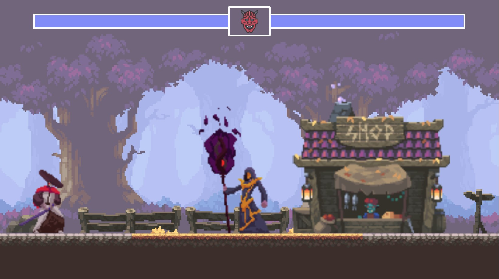

# **Samurai Combat: 2D Fighting Game**

### **About the Game**

_Samurai Combat_ is a 2D pixel-art fighting game inspired by Japanese samurai culture. Players select unique samurai warriors and engage in epic battles against each other in a limited arena. With stunning visuals and fluid gameplay, this project captures the intensity and beauty of traditional samurai duels.




## 📦 **Features**

-   Two-player competitive gameplay.
-   Pixel-art graphics inspired by Japanese culture.
-   Unique characters with distinct abilities and animations.
-   Limited arena fights for intense and focused combat.
-   Easy to learn, hard to master combat mechanics.

  

## 🌐 **Live Demo**

  

[Click here to play the game](https://abolfazlhatefi2004.github.io/samurai-battle/)

  
 

## **Gameplay**

 -   **Objective**: Defeat your opponent by depleting their health bar.
 -   **Controls**:

|Player 1  | Player 2: |
|--|--|
|**D:**  forward  |  **⬅️:**  forward |
|**A:**  back  | **➡️:**  back |
|**W:**  jump  |  **⬆️:**  jump|
|**S:**  hit   |  **⬇️:**  hit|


## 🛠️ **Installation**

  

1. Clone the repository:

```

git clone https://github.com/abolfazlhatefi2004/samurai-battle.git

```

  

2. Navigate to the project directory:

  

```

cd samurai-battle
```

4. Install dependencies:

```

npm install

```

5. Start the project:

```

npm start

```
6. Open your browser and play the game at `http://localhost:3000`.


### Learn More

  

You can learn more in the [Create React App documentation](https://facebook.github.io/create-react-app/docs/getting-started).

  

To learn React, check out the [React documentation](https://reactjs.org/).
 

## 🛠️ **Current Status**

  

- **Version**:  1.1.2

- **Development**: Maintenance Mode

  

## 🙌 **Contributing**

  

Contributions are welcome!

  

1. Fork the repository.

2. Create a feature branch.

3. Submit a pull request.
